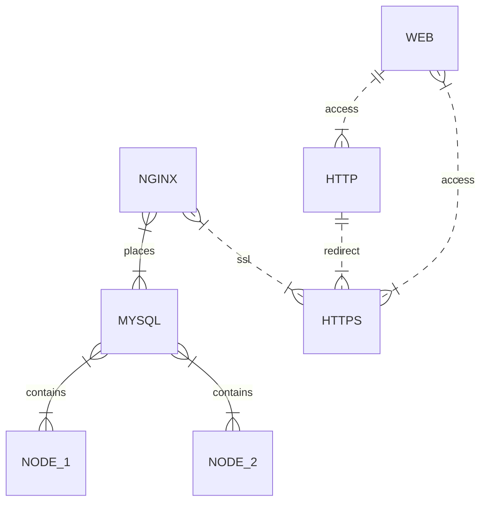

# Zabbix cluster installation (CentOS_8_Stream, Zabbix_6, MySQL)



flowchart LR
    classDef class1 fill:#3f3,stroke:#333,stroke-width:4px
    classDef class2 fill:#ff2400,stroke:#333,stroke-width:4px,color:#fff,stroke-dasharray: 12 5
    
    A:::class1 --> B:::class2

## MYSQL server
1. Update server, disable SELinux and install "nano" (optional)
   ```bash
   dnf update -y
   sed -i 's/^SELINUX=.*/SELINUX=disabled/g' /etc/selinux/config
   dnf install nano
   ```
2. Install MySQL-server and start service
   ```bash
   dnf install mysql-server
   systemctl start mysqld.service
   ```
3. Create database and users for backend and frontend servers authorization 
    - Enter the MySQL
    ```bash
    mysql
    ```
    - Create database and users. Since there can be several nodes, users are named like **zabbix_node1**, **zabbix_node2** etc.   
    ```mysql
    create database zabbix character set utf8mb4 collate utf8mb4_bin;
    create user zabbix_node1@ip_node1 identified by 'password';
    grant all privileges on zabbix.* to zabbix@ip_node1;
    create user zabbix_node2@ip_node2 identified by 'password';
    grant all privileges on zabbix.* to zabbix@ip_node2;
    create user zabbix_web@ip_web identified by 'password';
    grant all privileges on zabbix.* to zabbix@ip_web;
    ```
    - Exit from MySQL
    ```mysql
    exit
    ```
4. Install zabbix-sql-scripts and zabbix-agent2
    ```bash
    rpm -Uvh https://repo.zabbix.com/zabbix/6.0/rhel/8/x86_64/zabbix-release-6.0-1.el8.noarch.rpm
    dnf clean all
    yum makecache
    dnf install zabbix-sql-scripts zabbix-agent2
    zcat /usr/share/doc/zabbix-sql-scripts/mysql/server.sql.gz | mysql zabbix
    systemctl restart mysqld.service
    ```
5. Add rules for firewall-cmd
    ```bash
    firewall-cmd --zone=public --add-service=mysql --permanent
    firewall-cmd --zone=public --add-port=3306/tcp --permanent
    firewall-cmd --zone=public --add-port=4567/tcp --permanent
    firewall-cmd --zone=public --add-port=4568/tcp --permanent
    firewall-cmd --zone=public --add-port=4444/tcp --permanent
    firewall-cmd --add-service={http,https} --permanent
    firewall-cmd --add-port={10051/tcp,10050/tcp} --permanent
    firewall-cmd --reload
    ```
6. Edit zabbix_agent2 config
   - open config file
     ```bash
     nano /etc/zabbix/zabbix_agent2.conf
     ```
   - edit next lines
     ```
     Server=ip_node1,ip_node1
     ServerActive=ip_node1;ip_node1
     Hostname=hostname_database_server
     ```
7. Restart service and reboot server
   ```bash
   systemctl restart zabbix-agent2
   reboot
   ```
## Backend nodes (may be one or more)
    > we have two nodes for example

1. Update server, disable SELinux and install "nano" (optional)
   ```bash
   dnf update -y
   sed -i 's/^SELINUX=.*/SELINUX=disabled/g' /etc/selinux/config
   dnf install nano
   ```
2. Install zabbix backend nodes and zabbix-agent2
   ```bash
   drpm -Uvh https://repo.zabbix.com/zabbix/6.0/rhel/8/x86_64/zabbix-release-6.0-1.el8.noarch.rpm
   dnf clean all
   yum makecache
   dnf install zabbix-server-mysql zabbix-selinux-policy zabbix-agent2
   ```
3. Add rules for firewall-cmd
   ```bash
   firewall-cmd --add-service={http,https} --permanent
   firewall-cmd --add-port={10051/tcp,10050/tcp} --permanent
   firewall-cmd --reload
   ```
4. Edit zabbix_server config
   - open config file
     ```bash
     nano /etc/zabbix/zabbix_server.conf
     ```
   - edit next lines
     ```
     DBHost=mysql_server_ip
     DBName=zabbix
     DBUser=zabbix_node1(2)
     DBPassword=password
     HANodeName=name_node1(2)
     NodeAddress=ip_node1(2):10051
     ```
5. Edit zabbix_agent2 config
   - open config file
     ```bash
     nano /etc/zabbix/zabbix_agent2.conf
     ```
   - edit next lines
     ```
     Server=ip_node1,ip_node2
     ServerActive=ip_node1;ip_node2
     Hostname=hostname_node1(2)
     ```
6. Restart service and reboot server
   ```bash
   systemctl restart zabbix-agent2
   reboot
   ```
## Frontend server (**nginx**)
1. Update server, disable SELinux and install "nano" (optional)
   ```bash
   dnf update -y
   sed -i 's/^SELINUX=.*/SELINUX=disabled/g' /etc/selinux/config
   dnf install nano
   ```
2. Install zabbix parts for nginx and zabbix-agent2
   ```bash
   drpm -Uvh https://repo.zabbix.com/zabbix/6.0/rhel/8/x86_64/zabbix-release-6.0-1.el8.noarch.rpm
   dnf clean all
   yum makecache
   dnf install zabbix-web-mysql zabbix-nginx-conf zabbix-selinux-policy zabbix-agent2
   ```
3. Add rules for firewall-cmd
   ```bash
   firewall-cmd --add-service={http,https} --permanent
   firewall-cmd --add-port={10051/tcp,10050/tcp} --permanent
   firewall-cmd --reload
   ```
4. Edit nginx config
   - open config file
     ```bash
     nano /etc/nginx/conf.d/zabbix.conf
     ```
   - uncommented this lines change server_name value to this server ip address
     ```
     listen          80;
     server_name     ip_web;
     ```
5. Edit zabbix_agent2 config
   - open config file
     ```bash
     nano /etc/zabbix/zabbix_agent2.conf
     ```
   - edit next lines
     ```
     Server=ip_node1,ip_node2
     ServerActive=ip_node1;ip_node2
     Hostname=hostname_node1(2)
     ```
6. Restart service and reboot server
   ```bash
   systemctl restart zabbix-agent2
   reboot
   ```
7. Set up a database connection on first login
   - open the website http://ip_web
   - enter data to connect to the database
     ```
     database host   =   mysql_server_ip
     database port   =   0
     database name   =   zabbix
     user            =   zabbix_web
     password        =   password
     ```
8. Enable https and redirect http to https (optional)
   - install mod_ssl
     ```bash
     dnf install mod_ssl
     ```
   - create the folder for certificates and change permissions
     ```bash
     mkdir -p /etc/ssl/private/
     chmod 0750 /etc/ssl/private
     ```
   - create certificates and change permissions
     ```bash
     openssl req -newkey rsa:2048 -nodes -keyout /etc/ssl/private/zabbix.key -x509 -days 1825 -out /etc/ssl/certs/zabbix.crt -subj "/C=XX/ST=XX/L=XX/O=XX/OU=XX/CN=XX/emailAddress=X@X.lan"
     chmod 0400 /etc/ssl/certs/zabbix.crt
     chmod 0400 /etc/ssl/private/zabbix.key
     ```
   - rename zabbix config file to config file for ssl
     ```bash
     mv /etc/nginx/conf.d/zabbix.conf /etc/nginx/conf.d/zabbix-ssl.conf
     ```
   - Edit nginx ssl config and modify block "server"
     - open config file
       ```bash
       nano /etc/nginx/conf.d/zabbix-ssl.conf
       ```
     - edit next lines
       ```
       listen                   443 ssl;
       server_name              ip_web;
       ssl                      on;
       ssl_certificate          /etc/ssl/certs/zabbix.crt;
       ssl_certificate_key      /etc/ssl/private/zabbix.key;
       ```
   - Create nginx http config end add permanent redirect to https
     - create config file
       ```bash
       nano /etc/nginx/conf.d/zabbix.conf
       ```
     - add this lines
       ```
       server {
          listen              80;
          server_name         ip_web;
          return 301 https://$host$request_uri;
       }
       ```
   - Restart nginx services
     ```bash
     systemctl restart nginx php-fpm
     ```
     
#ENJOY! ;)
